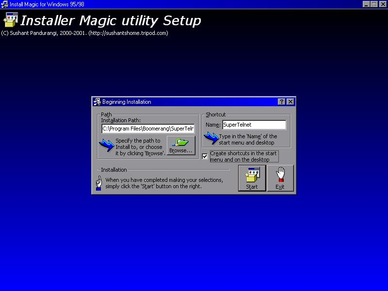



## iMagic32 \- Installation Utility \(UPDATED 31/3 \- MUCH BETTER\)

### Description

NEW: UNINSTALLER HAS BEEN INCLUDED. UPDATED 31 MARCH. This is the setup program for creating professional installations. It draws gradients with upto 15 COLOURS, and has wonderful icons and a thrilling interface with pictures and snazzy designs. The procedure is reallly straightforward but there can be more enhanced ways, which is why the source is here for you. For more information, Please see my web site at http://sushantshome.tripod.com/vb/index.html
 
### More Info
 

             |
---                |---
**Submitted On**   |2001-03-31 16:08:38
**By**             |[sushpa](https://github.com/Planet-Source-Code/PSCIndex/blob/master/ByAuthor/sushpa.md)
**Level**          |Intermediate
**User Rating**    |4.6 (32 globes from 7 users)
**Compatibility**  |VB 5\.0, VB 6\.0
**Category**       |[Complete Applications](https://github.com/Planet-Source-Code/PSCIndex/blob/master/ByCategory/complete-applications__1-27.md)
**World**          |[Visual Basic](https://github.com/Planet-Source-Code/PSCIndex/blob/master/ByWorld/visual-basic.md)
**Archive File**   |[CODE\_UPLOAD177433312001\.zip](https://github.com/Planet-Source-Code/sushpa-imagic32-installation-utility-updated-31-3-much-better__1-21886/archive/master.zip)

